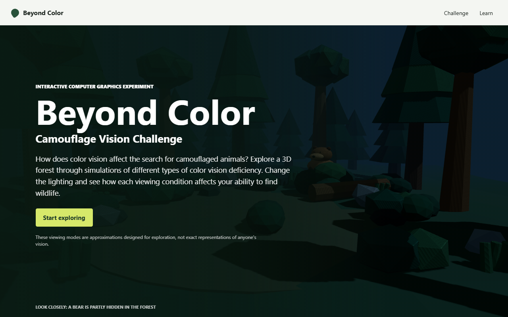
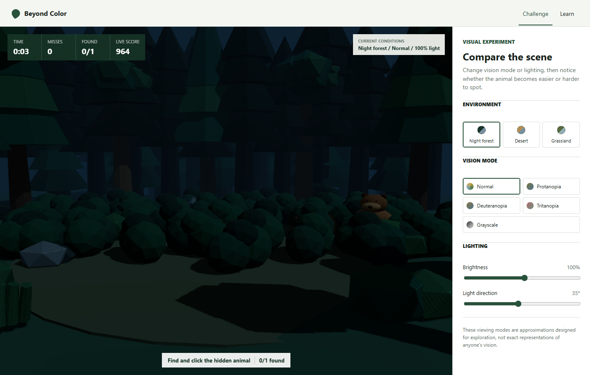
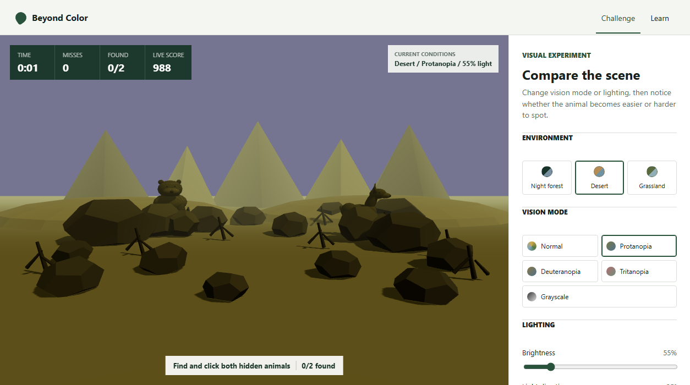
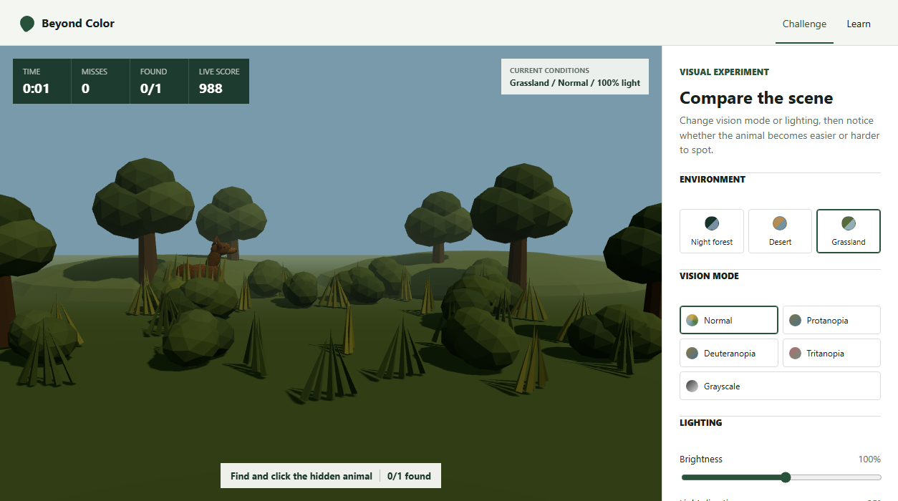

# Beyond Color: Camouflage Vision Challenge

An interactive computer graphics project that explores how color perception, lighting, shadows, texture, and scene construction affect the visibility of camouflaged wildlife.

**[Open the live game](https://rees390.github.io/camouflage-vision-game/)**



## Project Overview

How does color vision affect the search for camouflaged animals? Beyond Color places the player in interactive 3D environments containing a hidden bear, deer, or both. The player can change the simulated viewing condition, light brightness, and light direction before trying to find the animals.

The project is designed around a simple visual experiment: keep the scene and animal placement fixed while changing color or illumination. This makes it possible to observe how the same camouflage can become more or less noticeable as visual conditions change.

The main computer graphics topics demonstrated are:

- Construction and composition of interactive 3D scenes.
- Low-poly geometry and GLB asset rendering.
- Ambient, hemisphere, and directional lighting.
- Real-time shadows and illumination controls.
- Matrix-based color transformation.
- Texture, contrast, silhouette, and environmental occlusion.
- Raycast-based pointer interaction with 3D models.

## Screenshots

### Forest Experiment

The night forest combines trees, foliage, rocks, shadows, and foreground cover to break up the animals' silhouettes. The interface shows the active environment, vision mode, and brightness while the player searches.



### Comparing Conditions

The same controls work in the desert and grassland. This example uses the desert scene with the protanopia approximation and reduced brightness. Rocks hide much of the deer while leaving a recognizable, clickable silhouette.



### Grassland Environment

The grassland uses a lower, eye-level camera with layered shrubs, grass tufts, trees, and rolling terrain. Green and brown forms overlap across the scene, so the player must use movement-free cues such as silhouette, texture, and shadow to separate an animal from vegetation.



## How to Play

1. Select **Start exploring**.
2. Choose the night forest, desert, or grassland environment.
3. Select a vision mode and adjust the lighting.
4. Find and click the hidden animal or animals.
5. Avoid background clicks because every miss reduces the score.
6. Review the result explanation, replay the same conditions, or generate a new randomized challenge.

Each round contains either one or two animals. Their locations, rotations, scale, and nearby cover vary between rounds so positions cannot simply be memorized.

## Vision and Lighting Controls

| Control | Purpose |
| --- | --- |
| Normal | Displays the original scene colors. |
| Protanopia | Applies an approximate red-color-deficiency transform. |
| Deuteranopia | Applies an approximate green-color-deficiency transform. |
| Tritanopia | Applies an approximate blue-yellow-deficiency transform. |
| Grayscale | Removes hue information to emphasize luminance, shape, and texture. |
| Brightness | Changes the intensity of the scene lighting. |
| Light direction | Moves the directional light and changes cast-shadow placement. |

The color modes are implemented as RGB matrix transformations applied to scene and model materials. Lighting remains active after a color transform, allowing color and illumination to be compared together.

## How the Vision Modes Affect the Scenes

Color vision deficiency affects the ability to distinguish particular color combinations; it does not simply make every scene less colorful. The exact experience varies between people, so the descriptions below explain the intended effect of this project's approximate display transforms rather than claiming to reproduce anyone's vision exactly.

| Mode | General color effect | Effect in this project |
| --- | --- | --- |
| Normal | Preserves the original RGB relationships used by the scene materials. | Provides the baseline for comparing animal fur, vegetation, rocks, sky, and shadows. |
| Protanopia | Red-green distinctions are strongly reduced. Reds may also provide less useful separation from dark or green surroundings. | Warm brown fur can move closer to dark green forest foliage and brown terrain. In the desert, the animal and warm rocks may become harder to separate by hue alone. |
| Deuteranopia | Green-red distinctions are strongly reduced, although its color remapping differs from protanopia. | Green shrubs, grass, tree canopies, and brown animals can become more similar. Shape, brightness, and occlusion become more important in the forest and grassland. |
| Tritanopia | Blue-green, purple-red, and yellow-pink distinctions are reduced, and colors may appear less bright. | The relationship between blue sky, green vegetation, and yellow-brown terrain changes. This can alter background separation in all three scenes, especially the cool night forest and warm desert. |
| Grayscale | Removes hue from the educational display. This is not a representation of typical red-green or blue-yellow deficiency. | The player must rely entirely on luminance, texture, silhouette, lighting, and cast shadows to find the animal. |

The [National Eye Institute's guide to types of color vision deficiency](https://www.nei.nih.gov/eye-health-information/eye-conditions-and-diseases/color-blindness/types-color-vision-deficiency) explains that protanopia and deuteranopia affect red-green discrimination, while tritanopia affects several blue-green, purple-red, and yellow-pink distinctions. The [NHS overview](https://www.nhs.uk/conditions/colour-vision-deficiency/) also emphasizes that color vision deficiency generally means difficulty distinguishing colors rather than seeing no color at all.

## Environments and Models

### Night Forest

The primary environment is a Blender-authored low-poly night forest. Dense trees, shrubs, logs, rocks, and dark directional shadows produce the strongest camouflage challenge.

### Desert

The desert uses procedural low-poly dunes, rocks, dry shrubs, and a distant mountain line. Scene-specific rock cover and warmer animal tones reduce separation between wildlife and terrain.

### Grassland

The grassland uses hills, trees, grass tufts, and layered shrub clusters. Vegetation is positioned across the foreground and animal hiding areas to create natural occlusion.

The sitting brown bear and adult doe were generated in Blender using reproducible Python scripts. Their materials are cloned at runtime so color transforms and camouflage tinting can be applied without changing the exported GLB files.

## Scoring

Every round begins with 1,000 points:

```text
score = max(0, 1000 - elapsed_seconds * 12 - misses * 60)
```

The results screen reports time, misses, animals found, environment, vision mode, and a short explanation of how the selected visual conditions affected the available cues.

## Technology

- React 19 and TypeScript
- Vite
- Three.js
- React Three Fiber
- Blender 4.5 Python API (`bpy`)
- GLB / glTF assets
- GitHub Actions and GitHub Pages

## Project Structure

```text
camouflage-vision-game/
  .github/workflows/        GitHub Pages deployment
  assets/blender/           Blender source files and preview renders
  docs/screenshots/         README screenshots
  scripts/blender/          Reproducible model and scene generators
  web-app/
    public/models/forest/   Runtime GLB assets
    src/App.tsx             Scene rendering, game state, and UI
    src/App.css             Responsive interface styling
  PLAN.md                   Original project plan and acceptance checklist
  README.md                 Project documentation
```

## Run Locally

Requirements:

- Node.js 22 or a compatible current release.
- npm.

From the repository root on Windows:

```powershell
cd web-app
npm.cmd install
npm.cmd run dev
```

Open the local address printed by Vite, normally `http://127.0.0.1:5173/` or `http://localhost:5173/`.

On systems where npm is available directly, use `npm` instead of `npm.cmd`.

## Validation

Run the static checks and production build from `web-app`:

```powershell
npm.cmd run lint
npm.cmd run build
```

The production output is generated in `web-app/dist/`.

## Blender Asset Workflow

Reproducible Blender scripts are stored in `scripts/blender/`:

- `create_night_forest.py`
- `create_sitting_bear.py`
- `create_wild_deer.py`

The corresponding `.blend` source files and reference renders are stored in `assets/blender/`. Exported runtime models are stored in `web-app/public/models/forest/`.

The web application currently loads:

- `night_forest.glb`
- `sitting_bear.glb`
- `wild_deer.glb`

## Deployment

Pushing to the `main` branch triggers `.github/workflows/deploy-pages.yml`. The workflow installs dependencies with `npm ci`, creates a production build, uploads `web-app/dist`, and deploys it to GitHub Pages.

## Scientific Disclaimer

The color vision modes are approximate educational simulations designed for exploration. They are not exact representations of any individual's vision and must not be used for diagnosis or clinical assessment. Perception varies between people, displays, environments, and viewing conditions.

## Current Scope

This is a focused university demonstration rather than a clinical simulator or full hunting game. It prioritizes a reliable visual comparison across three environments, understandable controls, reproducible 3D assets, and a complete interaction loop from introduction to results.
